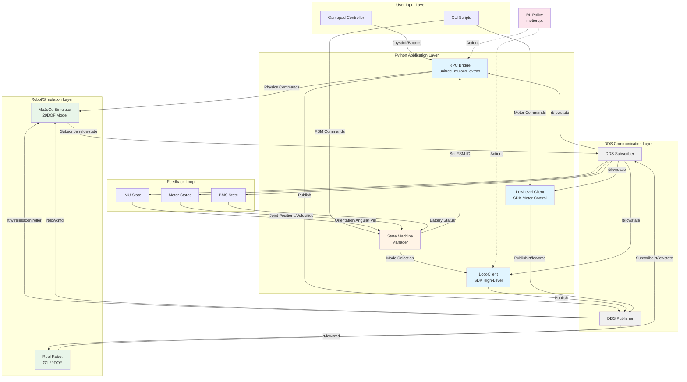
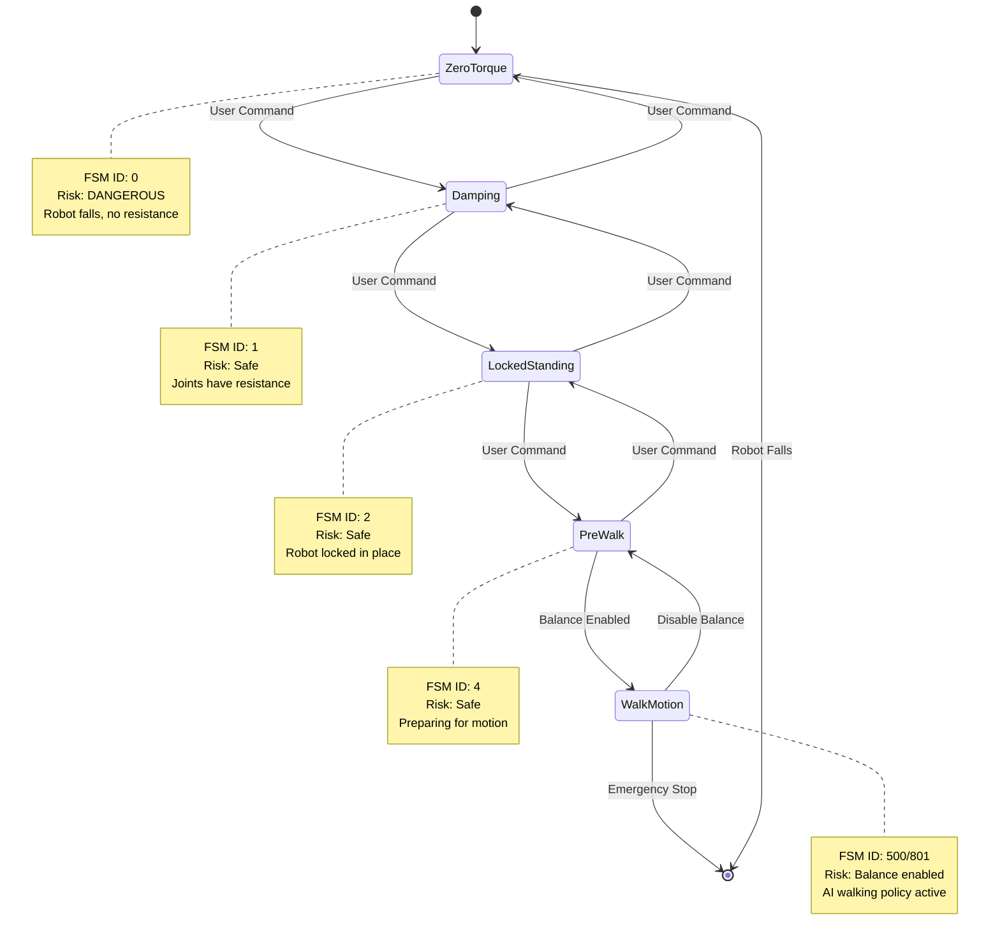
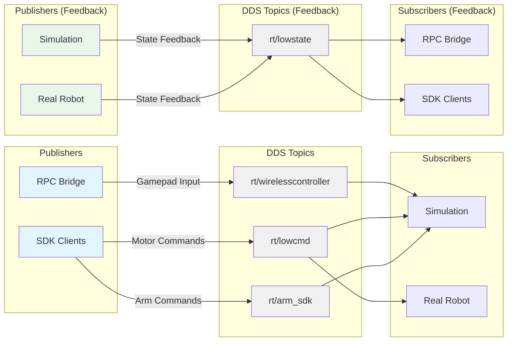
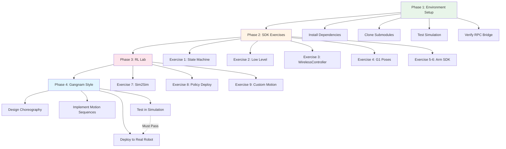
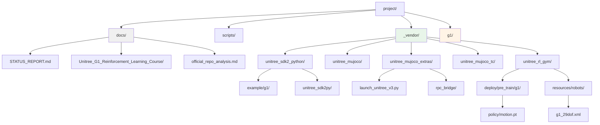

# Unitree G1 Gangnam Style - System Architecture

## Communication Flow Diagram



## State Machine Transitions



## DDS Topic Architecture



## Development Workflow



## File Structure Map



## Network Configuration

```mermaid
graph LR
    subgraph "Development Machine"
        APP[Python Application]
        DDS[DDS Middleware<br/>CycloneDDS]
    end

    subgraph "Network"
        ETH[Ethernet/WiFi]
    end

    subgraph "Robot PC2 (192.168.123.164)"
        ROBD[Robot Daemon]
    end

    subgraph "Simulation Mode"
        SIM[MuJoCo<br/>Loopback Interface]
    end

    APP -->|Domain ID: 1| DDS
    DDS -->|lo (localhost)| SIM
    DDS -->|eth0/wlan0| ETH
    ETH -->|192.168.123.164| ROBD

    style APP fill:#e1f5ff
    style DDS fill:#f0f0f0
    style SIM fill:#e8f5e9
    style ROBD fill:#e8f5e9
```

---

## Legend

| Color | Component Type |
|-------|---------------|
| Light Blue | Application Layer |
| Light Gray | Communication Layer |
| Light Green | Robot/Simulation |
| Light Yellow | User Input/Workflow |
| Light Pink | ML/RL Components |

| Symbol | Meaning |
|--------|---------|
| Solid Arrow | Data flow |
| Dashed Arrow | Optional/Conditional |
| State Box | FSM state |
| Subgraph | Logical grouping |